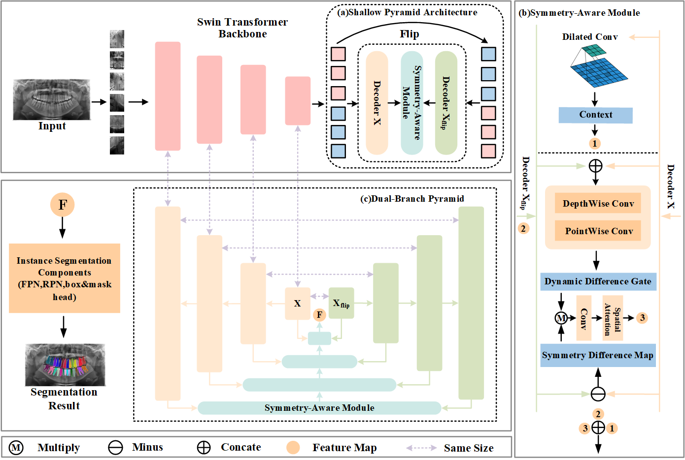

# Symmetry-Aware Dual-Branch Pyramid Network for Tooth Instance Segmentation with FDI-Based Numbering
This is the implementation code of the paper "Symmetry-Aware Dual-Branch Pyramid Network for Tooth Instance Segmentation with FDI-Based Numbering". We achieved state-of-the-art performance on the Tufts and O²PR benchmarks.



## Installation


This implementation is based on mmdetection(v3.3.0).This repository only contains the core code of our work, while the original mmdetection codebase is not included here.

## Datasets
We conducted experiments on the Tufts and O²PR datasets. The detailed information of the datasets is as follows:

| **Dataset**           | **Radiographs** | **Resolution** | **Teeth Type**                     | **Task**                                                     | **Download Link**                                            |
| --------------------- | --------------- | -------------- | ---------------------------------- | ------------------------------------------------------------ | ------------------------------------------------------------ |
| Tufts Dental Database | 1000            | 1615×840       | Permanent Teeth<br>Deciduous Teeth | Teeth Segmentation<br>Teeth Numbering<br>Abnormality Detection | [https://tdd.ece.tufts.edu/](https://tdd.ece.tufts.edu/)     |
| O²PR Dataset          | 1996            | 2440×1292      | Permanent Teeth<br>Deciduous Teeth | Teeth Segmentation<br>Teeth Numbering                        | [https://universe.roboflow.com/evident-mybn8/odontoai](https://universe.roboflow.com/evident-mybn8/odontoai) |

Before training and testing with the Tufts Dental Database, it must be converted to the MS COCO format. The conversion code is located in `Tufts/Tufts2COCO`, and the execution order is: 1. `split.py` 2. `annotationProcess.py` 3. `transformCOCO.py`.

## Training

1.Edit the "data_root" in the config file to your Tufts or O²PR dataset path. 
For example, for the Tufts Dental Database, open "configs/\_base_/datasets/coco_instance_Tufts.py" and 
set "data_root" to "[your-data-path]/Tufts/".

2.run the train script

``` bash
cd [project-root]
python tools/train.py configs/SADP_Net/SADP_Net.py
```
- You can specify the working directory by adding the `--work-dir` option.


## Testing

run the test script

``` bash
cd [project-root]
python tools/test.py configs/SADP_Net/SADP_Net.py [model-path]
```

- You can specify the working directory by adding the `--work-dir` option.
- You can add the `--show` option to overlay the test results on the images and display them in a new window. This only works for single-GPU testing and is intended for debugging and visualization. Make sure your environment supports GUI display.
- You can add the `--show-dir` option to overlay the test results on the images and save them to the specified directory.

## Results

### **Tufts Dental Database**

| **Methods**   | **Architecture** | **Backbone** | **Parameters (M)** | **mAP**  | **AP50** | **AP75** | **Accuracy** | **Recall** | **F1**   |
| ------------- | ---------------- | ------------ | ------------------ | -------- | -------- | -------- | ------------ | ---------- | -------- |
| IS Panoramic  | CNN              | ResNet       | 62.9               | 58.2     | 96.0     | 68.2     | 99.1         | 84.1       | 84.5     |
| ToothSNN      | CNN              | ResNet       | 66.5               | 58.1     | 96.7     | 67.2     | 99.2         | 84.6       | 85.3     |
| Cascade R-CNN | CNN              | ResNet       | 95.9               | 59.3     | 95.9     | 71.3     | 99.4         | 88.3       | 89.6     |
| SOLOv2        | CNN              | ResNet       | 65.6               | 57.0     | 91.8     | 68.9     | 93.9         | -          | -        |
| QueryInst     | CNN              | ResNet       | 191.3              | 58.5     | 95.7     | 69.0     | 99.4         | 87.4       | 89.2     |
| HTC           | CNN              | ResNet       | 140.0              | 61.5     | 97.3     | 74.4     | 99.5         | 89.9       | 90.9     |
| DetectoRS     | CNN              | ResNet       | 196.7              | 58.8     | 97.2     | 68.7     | 99.5         | 89.1       | 90.1     |
| Mask2Former   | Transformer      | Swin         | 68.7               | 59.9     | 96.7     | 71.9     | 99.5         | 89.5       | 90.3     |
| DentalMIM     | Transformer      | Swin         | 106.2              | 60.4     | 96.5     | 72.9     | 99.5         | 89.8       | 90.4     |
| Mask R-CNN    | Transformer      | ViT          | 43.5               | 57.6     | 95.5     | 68.0     | 98.9         | 80.4       | 81.1     |
| SPGTNet       | Transformer      | ViT          | 53.9               | 60.7     | 96.7     | 73.1     | 99.4         | 89.0       | 89.4     |
| SPGTNet\*     | Transformer      | BEiT         | 171.9              | 62.2     | 97.3     | 76.1     | 99.5         | 89.8       | 90.5     |
| **Ours-S**    | Transformer      | Swin         | 80.1               | 65.2     | 97.0     | 83.7     | 99.5         | 90.6       | 91.2     |
| **Ours-D**    | Transformer      | Swin         | 116.7              | **66.2** | **97.3** | **85.3** | **99.5**     | **90.9**   | **91.4** |

### **O²PR Dataset**

| **Methods**   | **Architecture** | **Backbone** | **Parameters (M)** | **mAP**  | **AP50** | **AP75** | **Accuracy** | **Recall** | **F1**   |
| ------------- | ---------------- | ------------ | ------------------ | -------- | -------- | -------- | ------------ | ---------- | -------- |
| IS Panoramic  | CNN              | ResNet       | 62.9               | 73.4     | 92.7     | 88.3     | 99.7         | 86.6       | 87.6     |
| ToothSNN      | CNN              | ResNet       | 66.5               | 72.6     | 91.4     | 87.5     | 99.7         | 83.7       | 85.1     |
| Cascade R-CNN | CNN              | ResNet       | 95.9               | 73.5     | 92.3     | 86.4     | 99.8         | 87.4       | 89.0     |
| SOLOv2        | CNN              | ResNet       | 65.6               | 69.8     | 87.3     | 81.5     | 96.1         | -          | -        |
| QueryInst     | CNN              | ResNet       | 191.3              | 75.7     | 95.6     | 90.2     | 99.8         | 89.6       | 90.8     |
| HTC           | CNN              | ResNet       | 140.0              | 76.5     | 96.4     | 90.5     | 99.9         | 93.3       | 94.4     |
| DetectoRS     | CNN              | ResNet       | 196.7              | 75.6     | 95.5     | 89.5     | 99.9         | 91.7       | 92.6     |
| Mask2Former   | Transformer      | Swin         | 68.7               | 75.6     | 95.9     | 89.6     | 99.8         | 90.4       | 90.1     |
| DentalMIM     | Transformer      | Swin         | 106.2              | 75.9     | 95.3     | 90.0     | 99.9         | 92.7       | 92.6     |
| Mask R-CNN    | Transformer      | ViT          | 43.5               | 73.2     | 92.8     | 86.1     | 99.7         | 82.5       | 83.2     |
| **Ours-S**    | Transformer      | Swin         | 80.1               | 77.2     | **99.0** | 91.4     | 99.9         | **94.7**   | **95.2** |
| **Ours-D**    | Transformer      | Swin         | 116.7              | **77.4** | 98.1     | **92.0** | **99.9**     | 91.7       | 92.8     |

### **Visualization results**


